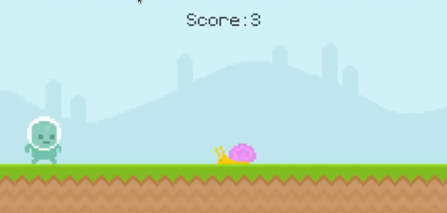

# Runner.py
## A 2D Game written in Python using [Pygame](https://www.pygame.org/wiki/GettingStarted).

## About
This is a game that was made by following along with Clear Code's [tutorial](https://youtu.be/AY9MnQ4x3zk) on Pygame. All rights to this game belong to Clear Code. You can find the original code [here](https://github.com/clear-code-projects/UltimatePygameIntro).

## Install

'''
git clone https://git.weiseguy.com/Weiseguy/Runner.py.git
cd Runner.py
pip install -r requirements.txt
python game.py
'''

